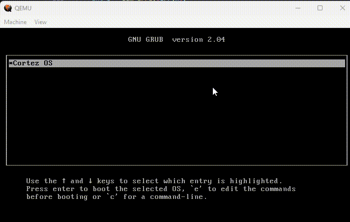

# Cortez OS



## Requisitos

- Docker
- Qemu
<br><br>
# Build Project

## Compilar e executar

```powershell
    ./build.ps1 --all
````

## Compilar

```powershell
    ./build.ps1 --compile
````

## Run Kernel mode

```powershell
    ./build.ps1 --runkernelmode
````

## run Iso

```powershell
    ./build.ps1 --runkerneliso
````


